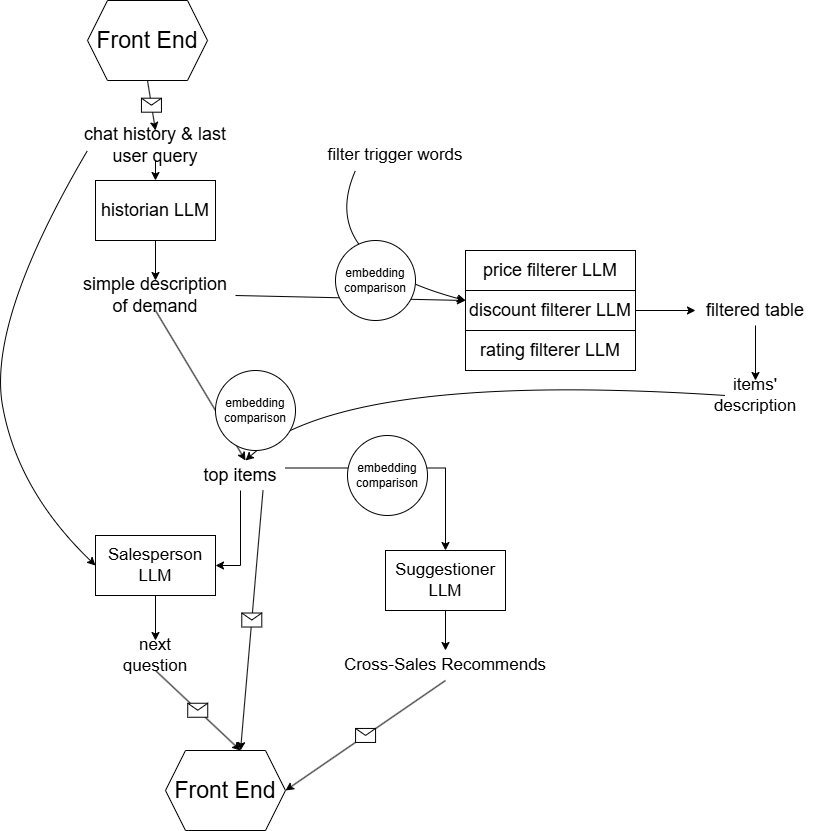

# RetailX-Hackathon

A MVP (Minimum Viable Product) Prototype of RetailX,  an intelligent AI assistant powered by [Mistral AI](https://github.com/mistralai) designed to provide an online shopping experience comparable to in-store retail.

Key ideas :  
- User-friendly, natural, visible shopping experience;
- Customized guidance, following the customer's previous choices;
- Scalable and comprehensible structure.

## Demo


## Usage

1. Download the dataset [Amazon-Sales-Dataset-EDA-94](https://www.kaggle.com/code/sonawanelalitsunil/amazon-sales-dataset-eda-94/notebook) and copy it to folder Data.

2. Create a file named "env.py" and add the following items:

```python
file_path = 'Data/amazon.csv'  # by default
api_key = "your_mistral_AI_API_key"
history_file_path = 'history.txt' # by default

pricer_path = 'Personalities/personality_pricer.txt'
discounter_path = 'Personalities/personality_discounter.txt'
rater_path = 'Personalities/personality_rater.txt'
salesperson_path = 'Personalities/salesperson.txt'
keyword_extractor_path = 'Personalities/keyword.txt'
```

3. Install the dependencies from `requirements.txt`

Tested Python version: `3.10.15`

4. Execute in the system terminal `gradio app.py`

Note: Data Preparation may take 30s to 1min.

## File Description

Frontend

- `app.py`: The main application file that runs the Gradio interface.
- `style.css`: Contains custom CSS styles for the Gradio interface.
- `api_frontend.py`: 

Backend

- `api_backend.py`: API for the frontend provided by the backend, also the local test code for backend. Contains the main workflow of Backend.  
- `functions.py`: Auxialiary Functions, implementing embedding comparisons and LLM calls.  

Data

- `env.py`: Contains environment variables such as file paths and API keys.
- `/Data/amazon.csv`: The dataset file containing Amazon sales data.

Miscellaneous

- `requirements.txt`: Lists all the dependencies required to run the project.
- `README.md`: This file, providing an overview and instructions for the project.
- `mock_request.py`: mock data for the frontend.  
- `history.txt`: A file to store the history of processed data or interactions. Used when testing backend.  
- `Personalities`: containing System Prompts of all LLM's used in the project.

## Technical Details
### Front-End  

The frontend is powered by the framework `gradio`. The backend is a simplified synchronous implementation of the system. Instead of leveraging asynchronous programming for handling concurrent requests or external API calls, it processes all incoming requests in a blocking manner.   

### Back-End  
The backend workflow chart looks like this: 




We use multiple Mistral AI LLM personalities:  
The historian extracts a one-phrase description of the user's demand from chat history;  
The price/discount/rating filterer extracts any "hard" criteria on those numerical columns, if applicable;  
The salesperson generates (based on previous conversations and relevant objects) a pertinent follow-up question to help narrow down.  
The suggestionner suggests (based on most relevant items) some items in another category as possible cross-sales.

The actual object-matching is done by local transformer models, by comparing text embeddings.  

Cross-sales is done by randomly picking marchandizes from the categories that appear among the most-relevant articles.  
We have hard-filter identification mechanisms on numerical features(price,discount rate,rating) and this is easily scalable if there is more similar features.  

## Model Evaluation

Mistral AI LLMs generally perform quite well on the given tasks;  
Rare hallucinations are observed, even with Large, but detectable and fixable by asking LLM to re-run.

Our chatbot is capable of treating common marchandize search requests, and can raise pertinent questions to narrow down.  
The suggestion engine successfully proposes the most relevant items, in a user-friendly way.  

## Future possibilities  

An (not implemented but) potentially promising idea is to train a LLM coder to write and auto-execute code snippets that can operate autonomously on the database;  
This can allow for more versatile question-answering capabilities related to the database.  

A Graph Neural Network that defines item similarity might be able to give more logical cross-sales suggestions.

